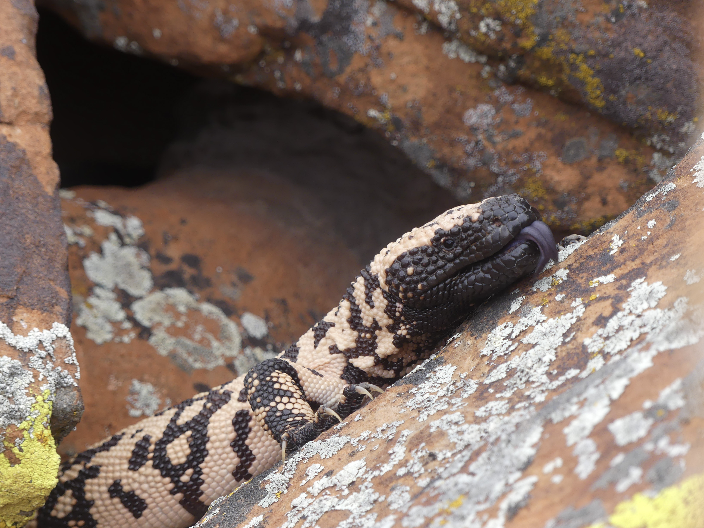
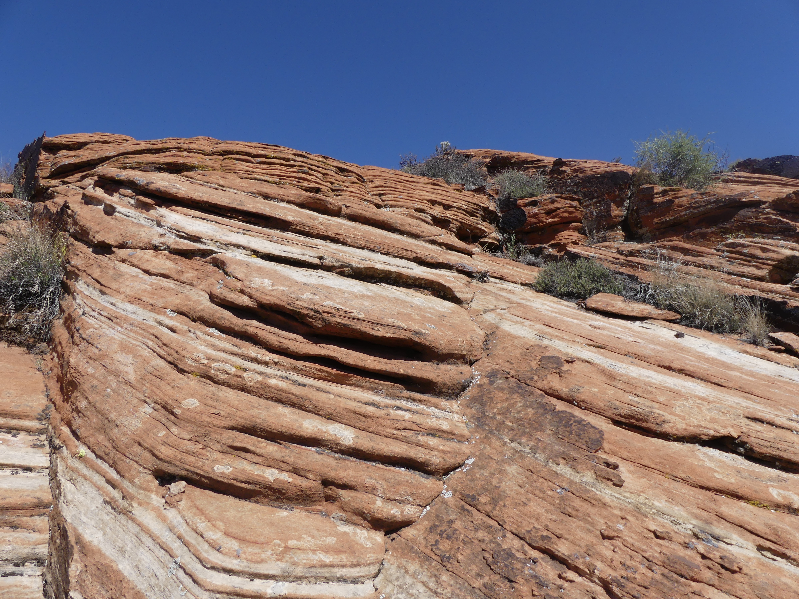
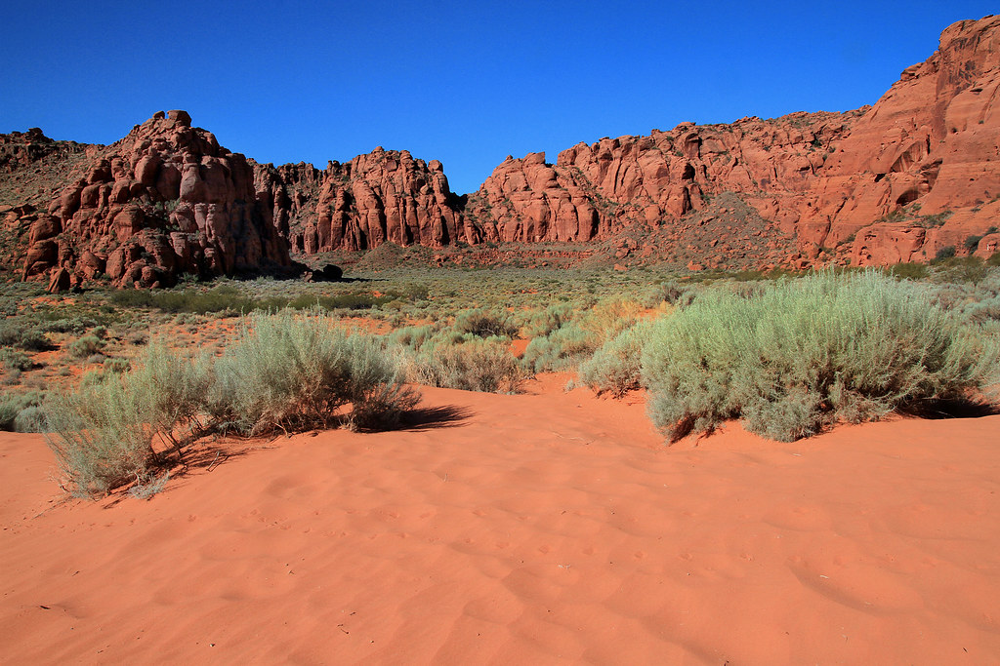
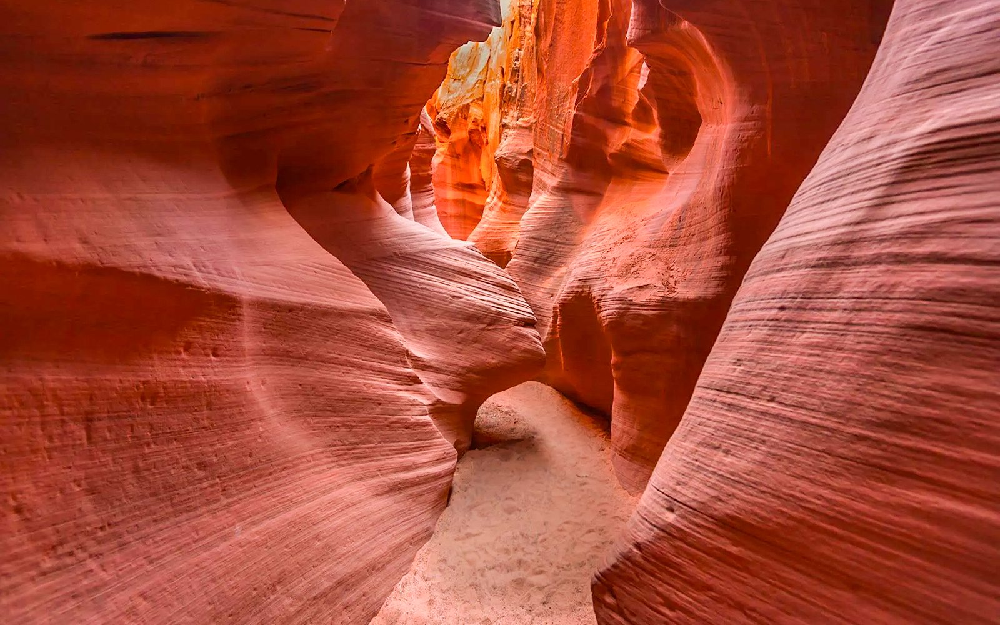

<style type="text/css">

body{ /* Normal  */
      font-size: 16px;
      text-align: justified;
}
.author {
  font-size: 14px;
  color: #8e8c84;
  text-align: center;
}
h1.title { /* Title*/
  font-size: 32px;
  color: Black;
  text-align: center;
}
h1 { /* Header 1 */
  font-size: 28px;
  color: Black;
  font-weight: bold;
}
p.caption{
  font: Lora;
  font-size: 14px;
}
</style>

```{r setup, include=FALSE}

# load in libraries
library(ggplot2)
library(arm)
library(ggfortify)
library(grid)
library(readr)
library(dplyr)
library(AICcmodavg)
library(performance)
library(patchwork)
library(cowplot)


# load in dataset
gilas <- read.csv("data/data_gmocc_all-edited.csv")

# knitr::opts_chunk$set(echo = TRUE)
```

<center></center>

# Introduction
The main goal of my thesis work is to create a model using presence/absence data to determine Gila monster (*Heloderma suspectum*) occupancy and detection probability in the Mojave desert in southern Utah. We conducted 500 time-constrained 1-km transect surveys across 6 sites in St. George, UT to collect data for this analysis. Along a transect, surveyors collected environmental and landscape data every 0.25 km (including start and end points). 

We created a  "Rockiness Index" on a scale from 1 - 7 to quantify the variablity in substrate texture along a transect:

<center>**1: Sandstone**</center>
<center></center>
<center>**2: Rocky-Cliff**</center>
<center></center>
<center>**3: Rocky-Debris Slope**</center>
<center></center>
<center>**4: Gravel-Small Rock**</center>
<center></center>
<center>**5: Stabilized Sand**</center>
<center></center>
<center>**6: Loose Sand**</center>
<center></center>
<center>**7: Fine Sand**</center>
<center></center>
<br>
For this exercise I am using a binary GLM to determine if there is a relationship between the probabilty of detecting a Gila monster during a survey and the substrate texture (as defined by the Rockiness Index). Addtionally creating an equation which best predicts Gila monster detection in a specific substrate type can inform future surveys for Gila monsters which are extremely difficult to find.

# Plots
First I created a generalized linear model plot and a linear model plot, then I  used the patchwork library to view the plots side-by-side.
```{r GLM, echo=TRUE}
plot.glm <-
  ggplot(gilas, aes(rock_ind, detection)) +    
  geom_jitter(size=2, width = 0.25) +       # jitter helps to see all data points; width for spread     
  geom_smooth(method="glm",
              fullrange = TRUE,                                       
              method.args=list(family="binomial"(link="logit"))) +
  labs(title="GM GLM Fit") +
  ylab ("Probability of Detection") +
  xlab ("Substrate Texture Index")
```

```{r Linear Fit, echo=TRUE}
plot.lm <-
  ggplot(gilas, aes(rock_ind, detection)) +
  geom_jitter(size=2, width = 0.25) +
  geom_smooth(method = "lm",
              fullrange= TRUE) +
  labs(title = "GM Linear Fit") +
  ylab("Probability of Detection") +
  xlab("Substrate Texture Index")
```

```{r Comparisons - patchwork, echo=TRUE}
plot.lm + plot.glm
```

Once I visualized the relationship I created and ran the model to look at the slope and intercept.
```{r Running the model}
model_rockiness <- glm(detection ~ rock_ind, data = gilas, family = binomial)
model_rockiness
```

To plot the model on the logit scale, I created a new column of logit fit "rockiness" data.
```{r logit : rockiness, echo=TRUE}
new_gilas <- data.frame(rock_ind = seq(0, 7, length.out = 100))
new_gilas$logit_fit <- predict(model_rockiness, newdata = new_gilas, type = "link") 
```
I also adjusted the detection presence/absence data to avoid a blank plot (i.e., log(0) or log(1)).
```{r continutiy correction, echo=TRUE}
gilas$detection_adj <- (gilas$detection + 0.5) / 2
gilas$logit_obs <- log(gilas$detection_adj / (1 - gilas$detection_adj))
```

Then I plot the model on the logit scale:
```{r Logit scale model plot}
ggplot() +
  geom_point(data = gilas, aes(x = rock_ind, y = logit_obs), color = "black", size = 3, alpha = 0.8) +
  geom_line(data = new_gilas, aes(x = rock_ind, y = logit_fit), color = "orange", linewidth = 1.2) +
  labs(
    title = "Substrate Model on Logit Scale",
    subtitle = "intercept = -13.57, slope = 1.76",
    x = "Substrate Texture Index",
    y = "Logit(Probability of Detection)")

```

# Model Interpretation
Next I wanted to look at the binned residuals and interpret the summary statistics.

```{r residuals, echo=TRUE}
x <- predict(model_rockiness)
y <- resid(model_rockiness)
binnedplot(x,y)

```

My residuals look like this because the number of detections (21) is so small that the model cannot calculate standard errors.
But I still want to interpret the slope to determine the relationship between the substrate type and detection probablity

```{r coefficients/ interpreting the slope, echo=TRUE}
summary(model_rockiness)
confint(model_rockiness)
coef(model_rockiness)
```

Looking at the summary table, we can see that substrate texture does have a significant positive effect on detection probability. The p-value is < 0.001 and the residual deviance is less than the degrees of freedom. The confidence intervals also do not overlap 0, so we can be confident that the relationship is positive. 

I estimated the maximum predicted effect of substrate type on detection probability by dividing the slope (1.759) by 4 (max predicted effect = 0.439). In this case, since my predictor variable is ordinal data (an index) I can interpret this to mean that as the substrate type "increases" from 1 - 7 (rockiest to sandiest) the probability of detecting a Gila monster increases by 44%. 

Biologically this makes sense because as a surveyor your chance of detecting a Gila monster or sign of a Gila will be greater in sandy washes or patches of sand where tracks can be left behind. Versus rocky cliffs or large sandstone structures where Gilas may be present but significantly harder to detect.

<center></center>
<br>
<center></center>
